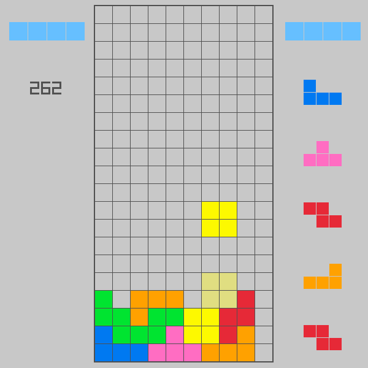

# raymino

configurable tetris build with raylib in C++ for desktop & web

[play web version here](https://sgs.moe/raymino)

## dependencies

_(pulled in via [CPM](https://github.com/cpm-cmake) [MIT])_

- [raylib](https://github.com/raysan5/raylib) [Zlib]
    - [#build-and-installation](https://github.com/raysan5/raylib?tab=readme-ov-file#build-and-installation)
- [raylib-cpp](https://github.com/RobLoach/raylib-cpp) [Zlib]
- [raygui](https://github.com/raysan5/raygui) [Zlib]
- [rres](https://github.com/raysan5/rres) [MIT] (currently unused)
- [magic_enum](https://github.com/Neargye/magic_enum) [MIT]

### dev only

- [Catch2](https://github.com/catchorg/Catch2) [BSL]
